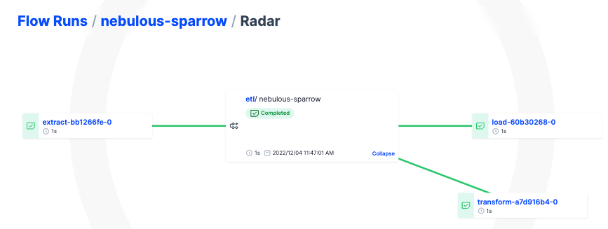

# **What is a `flow` and a `task`?**

### **Basic building blocks**

In Prefect, [Python is the API](https://www.prefect.io/guide/blog/announcing-prefect-orion/). You can just write Python. But to organize the steps, control their execution state, and get more [visibility](https://medium.com/the-prefect-blog/scheduled-vs-event-driven-data-pipelines-orchestrate-anything-with-prefect-b915e6adc3ba), there are two core concepts that serve as an **entrypoint** to orchestration:

1. `Task`—an (optional) function that represents a discrete `smallest` unit of work
2. `Flow`— a container for business logic and orchestration rules for any executable/schedulable process

You may combine `tasks`, `flows`, and `subflows` into composable and modular workflows in various ways depending on what you are trying to achieve.

<aside>
👇 To To understand those various ways, let’s get hands-on

</aside>

### Exercise: Hello World

```python
from prefect import flow

@flow(log_prints=True)
def hi():
    print("Hi from Prefect, LiveEO! 🤗")

if __name__ == "__main__":
    hi()
```

### Exercise: Hello World with a `task`

```python
from prefect import flow, task, get_run_logger

@task
def hello_world():
    logger = get_run_logger()
    logger.info("Hello from the workshop!")

@flow(log_prints=True)
def hi():
    print("Hi from Prefect, LiveEO! 🤗")
    hello_world()

if __name__ == "__main__":
    hi()
```

### Exercise: Hello World with a `mapped` task

```python
from prefect import flow, task
from typing import List

@task
def hello_world(user: str):
    print(f"✨ Hello from the workshop, {user}! 👋 📚")

@flow(log_prints=True)
def hi(
    users: List[str] = [
        "Marvin",
        "Anna",
        "Toby",
        "Rebecca",
        "Amelie",
        "Carlo",
        "Christian V.",
        "Christian R.",
        "Fernando",
        "Francesco",
        "Jorge",
        "Justin",
        "Laxmi",
        "Miguel",
        "Wieger",
        "Tobias",
    ]
):
    print("Hi from Prefect, LiveEO! 🤗")
    hello_world.map(users)

if __name__ == "__main__":
    hi()
```

### Exercise: Hello World with a `for` loop running concurrently

```python
from prefect import flow, task
from typing import List

@task
def hello_world(user: str):
    print(f"✨ Hello from the workshop, {user}! 👋 📚")

@flow(log_prints=True)
def hi(
    users: List[str] = [
        "Marvin",
        "Anna",
        "Toby",
        "Rebecca",
        "Amelie",
        "Carlo",
        "Christian V.",
        "Christian R.",
        "Fernando",
        "Francesco",
        "Jorge",
        "Justin",
        "Laxmi",
        "Miguel",
        "Wieger",
        "Tobias",
    ]
):
    print("Hi from Prefect, LiveEO! 🤗")
    for user in users:
        hello_world.with_options(name=user).submit(user)

if __name__ == "__main__":
    hi()
```

### Q: can you call a `task` from another `task`?

since tasks are the smallest units already, [you can’t call tasks from other tasks](https://discourse.prefect.io/t/can-i-call-a-task-from-another-task/1453), but you can call `task.fn()` - you can do the same from both a task and a flow

### Q: what are the downsides of calling a `task` from another `task`?

To answer that, run the following flow:

```python
from prefect import task, flow

@task
def special_data():
    return 42

@task
def extract_data():
    return special_data.fn()

@flow(log_prints=True)
def get_data():
    x = extract_data()
    print(x)

if __name__ == "__main__":
    get_data()
```

### Solution

you can call a task functions using `task.fn()` but you would lose visibility

Go to the UI and validate that `special_data` task is not visible in the UI
If you go to the UI you’ll see that this task ran with `task.fn()` is not visible in the UI

### Exercise: try the following example in `ipython` 

```python
ipython
```

```python
from prefect import task, flow

@task
def extract_data():
    return 42

@flow
def get_data():
    return 42
```

```python
extract_data()
```

should fail with: 

```
RuntimeError: Tasks cannot be run outside of a flow. 
To call the underlying task function outside of a flow use `task.fn()`.
```

Following this advice, it works:

```python
extract_data.fn()
```

```python
get_data.fn()
```

### Q: can you call a `flow` from other `flow`?

you can call `subflows` from any of your (*parent*) flows

### Exercise: call a flow from another flow + validate in the UI that both flows got executed

```python
from prefect import task, flow

@flow
def extract_data():
    return 42

@flow(log_prints=True)
def get_data():
    x = extract_data()
    print(x)

if __name__ == '__main__':
    get_data()
```


### Exercise: navigate to the UI to the child flow `extract_data`: can you find out which `parent flow run` triggered that `child flow run`?


# **When to use a `flow, task vs. subflow`?**

- You always need a `flow`
- You may optionally add a task for extra `visibility`, `caching`, tag-based **`concurrency` limits**, concurrent & `parallel` execution
- You may add `subflows` to `group` related tasks within a flow + allow `reusing` the same group of tasks in multiple places

We’ll talk about caching and task runners in more detail later, so let’s look now at the **task-level concurrency** with an exercise

## Exercise: add a `tag` called `“db”` and ensure that no more than 3 task runs of that task are executed concurrently

```bash
prefect concurrency-limit --help  # this will help you figure out the right command to create that task-level concurrency limit
```

```python
import time
from prefect import task, flow

@task(tags=["db"])
def db_task():
    print("using DB connection, need to mitigate DB pressure")
    time.sleep(10)

@flow(log_prints=True)
def db_flow():
    for i in range(1, 10):
        db_task.with_options(name=f"db_{i}").submit()

if __name__ == "__main__":
    db_flow()
```

### Solution

```bash
prefect concurrency-limit create db 3
```

Flow with task using that concurrency limit:

```python
import time
from prefect import task, flow

@task(log_prints=True, tags=["db"])
def db_task():
    print("using DB connection, need to mitigate DB pressure")
    time.sleep(10)

@flow
def db_flow():
    for i in range(1, 10):
        db_task.with_options(name=f"db_{i}").submit()

if __name__ == "__main__":
    db_flow()
```

Soon, you’ll be able to configure and monitor task run concurrency slots from the UI!

## Q: can you pass data between tasks?

yes, a simple example:

```python
from prefect import task, flow

@task
def extract() -> int:
    return 42

@task
def transform(x: int) -> int:
    return x * 2

@task
def load(x: int) -> None:
    print(x)

@flow(log_prints=True)
def etl_oneliner():
    load(transform(extract()))
```

## Q: What’s the difference between those 3 different ways of calling tasks within a flow?

Tasks:

```python
from prefect import task, flow

@task
def extract() -> int:
    return 42

@task
def transform(x: int) -> int:
    return x * 2

@task
def load(x: int) -> None:
    print(x)
```

Flow 1: oneliner

```python
@flow(log_prints=True)
def etl_oneliner():
    load(transform(extract()))
```

- Full example

    ```python
    from prefect import task, flow
    
    @task
    def extract() -> int:
        return 42
    
    @task
    def transform(x: int) -> int:
        return x * 2
    
    @task
    def load(x: int) -> None:
        print(x)
    
    @flow(log_prints=True)
    def etl():
        load(transform(extract()))
    
    if __name__ == "__main__":
        etl()
    ```


Flow 2: cleaner

```python
@flow(log_prints=True)
def etl():
    e = extract()
    t = transform(e)
    load(t)
```

- Full example

    ```python
    from prefect import task, flow
    
    @task
    def extract() -> int:
        return 42
    
    @task
    def transform(x: int) -> int:
        return x * 2
    
    @task
    def load(x: int) -> None:
        print(x)
    
    @flow(log_prints=True)
    def etl():
        e = extract()
        t = transform(e)
        load(t)
    
    if __name__ == "__main__":
        etl()
    ```


Flow 3: cleaner & submitted to TaskRunner

```python
@flow(log_prints=True)
def etl_with_tr():
    e = extract.submit()
    t = transform.submit(e)
    load.submit(t)
```

- Full example

    ```python
    from prefect import task, flow
    
    @task
    def extract() -> int:
        return 42
    
    @task
    def transform(x: int) -> int:
        return x * 2
    
    @task
    def load(x: int) -> None:
        print(x)
    
    @flow(log_prints=True)
    def etl():
        e = extract.submit()
        t = transform.submit(e)
        load.submit(t)
    
    if __name__ == "__main__":
        etl()
    ```


## Solution to the difference

Answer: lineage + tracking of data dependencies with small objects like small integers

[https://github.com/PrefectHQ/prefect/issues/7777](https://github.com/PrefectHQ/prefect/issues/7777)




Problem: we can’t track small integers because Python uses the same memor address for every instance.

The same lineage works for dataframes even without returning states or submitting tasks to a task runner:

```python
from prefect import flow, task
import pandas as pd

@task
def get_dataframe() -> pd.DataFrame:
    return pd.DataFrame(data={"Users": ["Marvin", "You"]})

@task
def add_points(df: pd.DataFrame) -> pd.DataFrame:
    df["Karma_Points"] = [-42, 100]
    return df

@flow
def process_data() -> pd.DataFrame:
    df = get_dataframe()
    return add_points(df)

if __name__ == "__main__":
    result = process_data()
    print(result)
```


A good workaround for this lineage problem is to return state when passing small int values as data dependencies:

```python
from prefect import task, flow

@task
def extract() -> int:
    return 42

@task
def transform(x: int) -> int:
    return x * 2

@task
def load(x: int) -> None:
    print(x)

@flow(log_prints=True)
def etl():
    e = extract(**return_state=True**)
    t = transform(e, return_state=True)
    load(t, return_state=True)

if __name__ == "__main__":
    etl()
```

## Q: can you pass data between subflows and tasks?

yes, a simple example:

```python
from prefect import flow

@flow
def extract_data():
    return 42

@flow
def transform_data(x: int) -> int:
    return x * 2

@flow(log_prints=True, name="ETL with subflows")
def main():
    x = extract_data()
    y = transform_data(x)
    print(x)
    print(y)

if __name__ == "__main__":
    main()
```

- **Challenge**: what’s the difference betwee the above flow and this one? **Tip: check the UI and logs!**

    ```python
    from prefect import flow
    
    @flow
    def extract_data():
        return 42
    
    @flow
    def transform_data(x: int) -> int:
        return x * 2
    
    @flow(log_prints=True, name="Parent ETL flow with subflows")
    def main():
        x = extract_data(return_state=True)
        y = transform_data(x, return_state=True)
        print(x.result())
        print(y.result())
    
    if __name__ == "__main__":
        main()
    ```


Additionally using a task:

```python
from prefect import flow, task

@flow
def extract_data():
    return 42

@flow
def transform_data(x: int) -> int:
    return x * 2

@task
def load(x: int, y: int) -> None:
    print(x)
    print(y)

@flow(log_prints=True, name="ETL with subflows")
def main():
    x = extract_data()
    y = transform_data(x)
    load(x, y)

if __name__ == "__main__":
    main()
```

## "When should I use a subflow instead of a task?"

### Task

We recommend writing `tasks` that do a discrete unit of work in your workflow:

- calling an `API`
- performing a `database` operation

`Prefect tasks` are well suited to `parallel` or distributed execution using Dask or Ray. For `troubleshooting`, the more granular you create your tasks, the easier it is to find and fix issues.

### Subflow

`Subflows` enable you to `group` related tasks within your workflow.

Here are some `scenarios` where you might choose to use a subflow rather than calling tasks individually:

- Observability: you'll see subflow status in the **Flow Runs** dashboard rather than as tasks within a specific flow run.
- Conditional flows: If you have a **group** of tasks that run only under certain **conditions**, you can group them within a subflow and conditionally run the subflow rather than each task individually.
- Parameters: Flows have first-class support for `parameterization` + **pydantic `validation` of input parameters**, making it easy to run the same group of tasks in different use cases by simply passing different parameters to the subflow in which they run.
- Task runners: Subflows enable you to specify the task runner used for tasks within the flow. For example, if you want to optimize **parallel execution** of certain tasks with Dask/Ray, you can group them in a subflow that uses the Dask/Ray task runner. `You can use a different task runner for each subflow`.