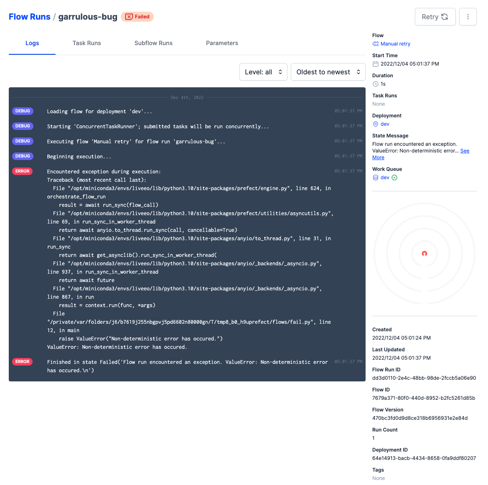
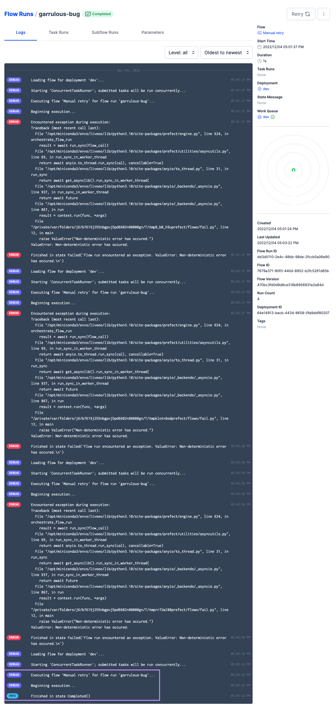

# **`Retries` - task & flow-level, automated & manual (deployment-only)**

**What are retries?**

- the rerun a failed task or flow
- they work on task or flow level (i.e. both)

| retries | An optional number of times to retry on flow run failure. |
| --- | --- |
| retry_delay_seconds | An optional number of seconds to wait before retrying the flow after failure. This is only applicable if retries is nonzero. |

## CHALLENGE: H**ow would you add 5 `automated retries` every 5 min to a flow (or subflow or task)?**

```python
# Adding it to a task works the same way

from prefect import flow
import random

@flow(retries=5, retry_delay_seconds=300, log_prints=True)
def retry_it():
    print("Hi from Prefect! 🤗")
    if random.random() > 0.5:
        raise ValueError("Non-deterministic error has occured.")

if __name__ == '__main__':
    retry_it()
```

## How do `manual retries` from the UI work?

Let’s comment out the automated **retries** from the **decorator** to experiment with **manual retries** from the UI:

```python
from prefect import flow
import random

@flow(name="Manual retry")  # (retries=5, retry_delay_seconds=300, log_prints=True)
def main():
    print("Hi from Prefect! 🤗")
    if random.random() > 0.5:
        raise ValueError("Non-deterministic error has occured.")

if __name__ == '__main__':
    main()
```

By disabling automated retries on both a task and flow level, the flow run will *potentially* end in a `Failed` state (*the error is raised at random*), and when it does, you will get a failure notification.

## **Important note ❗️**

To leverage the manual retries from the UI, it’s best if you toggle **`result persistence`** to ensure that any dataflow that passes data between tasks and subflows can store and later retrieve the results:

```
prefect config set PREFECT_RESULTS_PERSIST_BY_DEFAULT=true
```

To read more about [results](https://docs.prefect.io/concepts/results/), check the documentation.

> ⚠️ Note that, in contrast to `automated` retries, `**manual` retries from the UI work only for flow runs triggered from deployments.**
>

## **🤖 Create a deployment**

```bash
prefect deployment build -n dev -q dev flows/fail.py:main -a
```

To start a flow run from a deployment, you can use the command (or do this from the UI):

```bash
prefect deployment run 'Manual retry/dev'
```

```bash
prefect agent start -q dev
```

## Manually retry until it succeeds



That’s everything you need to do to manually retry a flow run from the UI.

You may end up having to repeat that a couple of times, but eventually, it should succeed (*unless the randomness gods really conspire against you*):



This simple use case demonstrates how valuable the **Retry** from failure feature can be, especially when dealing with flaky APIs.