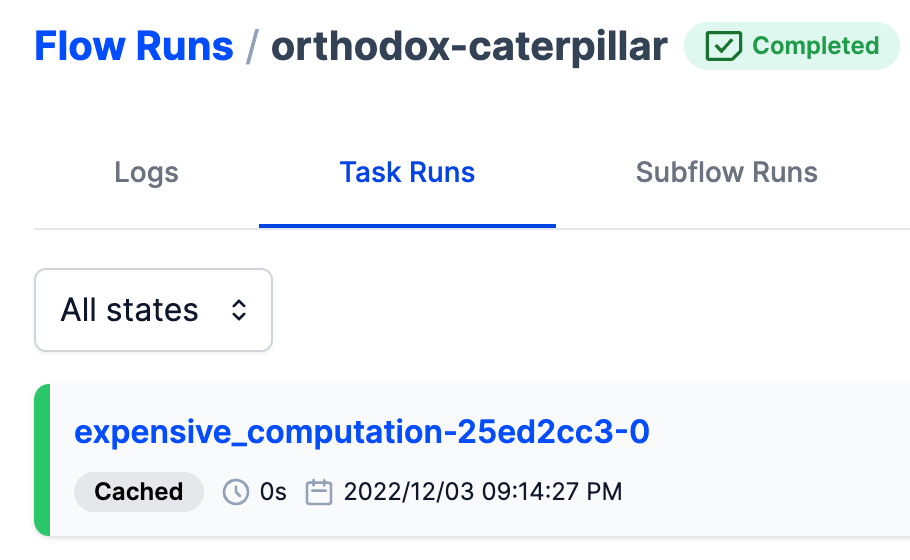
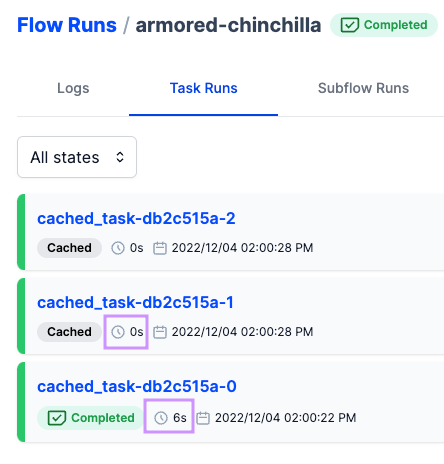
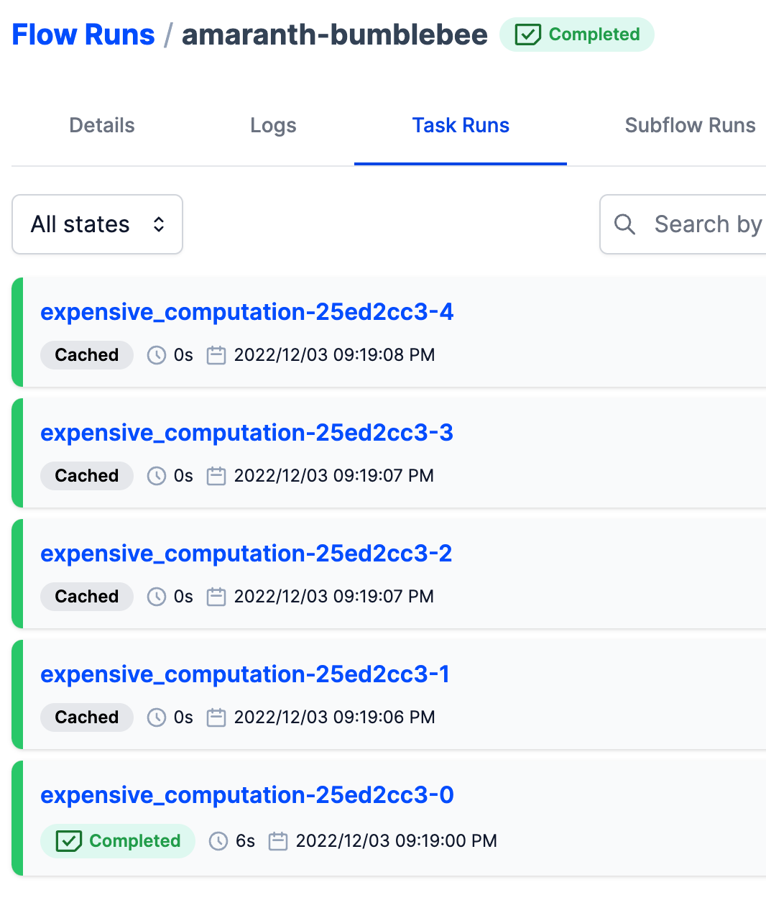

# What is **`Caching`?**

Ability of a task run to reflect a `finished state without actually running the code` that defines the task.

- allows you to **reuse results of tasks that may be expensive to run with every flow run**,
- allows reuse of cached results **e.g. if the `inputs` to a task have `not changed`**

## What is a **`cache_key`?**

Cache key = string value that indicates if one run should be considered identical to another

- When a task run with a cache key finishes, we `attach that cache key to the state`.
- When each task run starts, Prefect checks for states with a matching cache key. **If a state with an identical key is found, Prefect will `use the cached state`** instead of running the task again

## What is a **`cache_key_fn`?**

Cache key function is a **generic function** that accepts two positional arguments:

- **context**:  `TaskRunContext`, which stores task run metadata in the attributes `task_run_id`, `flow_run_id`, and `task`.
- **parameters**: a dictionary of **input values to the task**. For example, if your task is defined with signature `fn(x, y, z)` then the dictionary will have keys `"x"`, `"y"`, and `"z"` with corresponding values that can be used to compute your cache key.

<aside>
⚠️ Note that the `cache_key_fn` is *not* defined as a `@task`.

</aside>

```python
from prefect import task, flow

**def static_cache_key(context, parameters):
    return "static cache key"**

@task(cache_key_fn=**static_cache_key**)
def cached_task():
    print('running an expensive operation')
    return 42

@flow
def test_caching():
    cached_task()
    cached_task()
    cached_task()
```

## **`Caching`: simple**

```python
from datetime import timedelta
from prefect.tasks import **task_input_hash**
from prefect import task, flow
import time

@task(cache_key_fn=**task_input_hash**, cache_expiration=timedelta(minutes=1))
def expensive_computation() -> int:
    time.sleep(5)
    return 42

@flow
def cache_it():
    expensive_computation()

if __name__ == "__main__":
    cache_it()
```

First run: `Completed`

Second run: `Cached`

…until `cache_expiration` passes



## **`Caching`: static cache key (same as shown in intro - let’s run it!)**

```python
from datetime import timedelta
from prefect import flow, task
import time

def static_cache_key(context, parameters):
    return "static constant as a cache key"

@task(cache_key_fn=static_cache_key, cache_expiration=timedelta(seconds=20))
def cached_task():
    print("running an expensive operation")
    time.sleep(5)
    return 42

@flow(name="Static cache key flow", log_prints=True)
def main():
    cached_task()
    cached_task()
    cached_task()

if __name__ == "__main__":
    main()
```




## `Caching`: only within a single flow run (matching flow run ID)

```python
from datetime import timedelta
from prefect.tasks import task_input_hash
from prefect import task, flow
import time
from prefect.context import get_run_context

def cache_within_flow_run(context, parameters):
    **id_ = context.task_run.flow_run_id**
    key = f"{**id_**}-{task_input_hash(context, parameters)}"
    print(f"🔑Cache key: {key}")
    return key

@task(cache_key_fn=**cache_within_flow_run**, cache_expiration=timedelta(minutes=1), log_prints=True)
def expensive_computation() -> int:
    print("running an expensive operation")
    time.sleep(5)
    return 42

@flow(log_prints=True)
def cache_it():
    print(**get_run_context().flow_run.id**)
    for _ in range(5):
        expensive_computation()

if __name__ == "__main__":
    cache_it()
```


